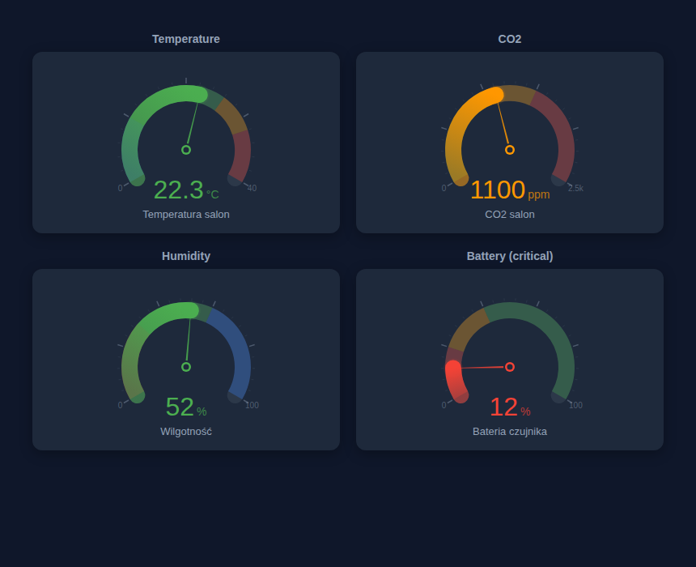
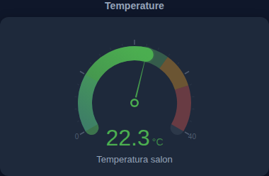
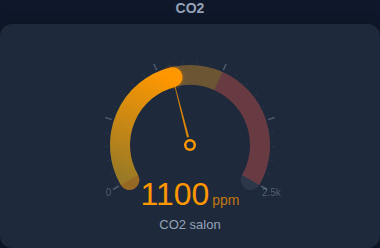
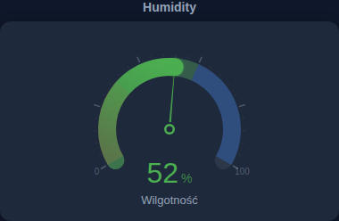
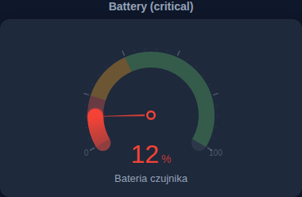

# Animated Gauge Card

[](https://github.com/hacs/integration)
[](LICENSE)


A custom gauge card for [Home Assistant](https://www.home-assistant.io/) with smooth needle animation, color severity segments, tick marks, and gradient active arc. Part of the **Animated Cards** family.

## Preview



| Temperature | CO2 |
|:-:|:-:|
|  |  |

| Humidity | Battery (critical) |
|:-:|:-:|
|  |  |

## Features

- **Smooth needle animation** — value transitions with ease-out cubic easing
- **Color severity segments** — background arc colored by value ranges
- **Gradient active arc** — filled arc with gradient and glow at tip
- **Tick marks** — auto-calculated major/minor ticks with labels
- **Min/Max labels** — displayed at arc endpoints
- **Needle** — triangular needle with center cap (toggleable)
- **Auto-color** — value text changes color based on active segment
- **Visual editor** — GUI with entity autocomplete and severity segment builder
- **Internationalization** — English, Polish, German

## Installation

### HACS (Custom Repository)

1. HACS → **Frontend** → **⋮** → **Custom repositories**
2. Add `https://github.com/smalarz/animated-gauge-card` — Category: **Dashboard**
3. **Install** → Restart HA → `Ctrl+Shift+R`

### Manual

1. Download `animated-gauge-card.js` from [releases](https://github.com/smalarz/animated-gauge-card/releases)
2. Copy to `/config/www/animated-gauge-card.js`
3. Resources → `/local/animated-gauge-card.js` → JavaScript Module

## Configuration

### Temperature

```yaml
type: custom:animated-gauge-card
entity: sensor.temperature
name: Temperatura salon
min: 0
max: 40
unit: "°C"
decimals: 1
severity:
  - from: 0
    to: 10
    color: "#3b82f6"
  - from: 10
    to: 26
    color: "#4caf50"
  - from: 26
    to: 32
    color: "#ff9800"
  - from: 32
    to: 40
    color: "#f44336"
```

### CO2

```yaml
type: custom:animated-gauge-card
entity: sensor.co2
name: CO2
min: 0
max: 2500
severity:
  - from: 0
    to: 1000
    color: "#4caf50"
  - from: 1000
    to: 1500
    color: "#ff9800"
  - from: 1500
    to: 2500
    color: "#f44336"
```

### Battery (reversed)

```yaml
type: custom:animated-gauge-card
entity: sensor.battery
name: Bateria
min: 0
max: 100
unit: "%"
severity:
  - from: 0
    to: 20
    color: "#f44336"
  - from: 20
    to: 40
    color: "#ff9800"
  - from: 40
    to: 100
    color: "#4caf50"
```

## Options

| Option | Type | Default | Description |
|--------|------|---------|-------------|
| `entity` | string | **required** | Entity ID |
| `name` | string | friendly_name | Display name |
| `min` | number | `0` | Minimum value |
| `max` | number | `100` | Maximum value |
| `unit` | string | auto | Unit of measurement |
| `decimals` | number | `0` | Decimal places |
| `severity` | list | green/orange/red | Color segments (from/to/color) |
| `needle` | boolean | `true` | Show needle |
| `show_value` | boolean | `true` | Show value text |
| `show_name` | boolean | `true` | Show entity name |
| `show_min_max` | boolean | `true` | Show min/max labels |
| `show_ticks` | boolean | `true` | Show tick marks |
| `show_segments_label` | boolean | `false` | Show tick value labels |
| `arc_width` | number | `20` | Arc thickness in pixels |
| `sweep_angle` | number | `240` | Arc sweep angle in degrees |

## Related Cards

- [Animated Weather Card](https://github.com/smalarz/animated-weather-card)
- [Animated Graph Card](https://github.com/smalarz/animated-graph-card)
- [Animated Plant Card](https://github.com/smalarz/animated-plant-card)
- [Animated Pie Card](https://github.com/smalarz/animated-pie-card)

## License

[MIT](LICENSE)
